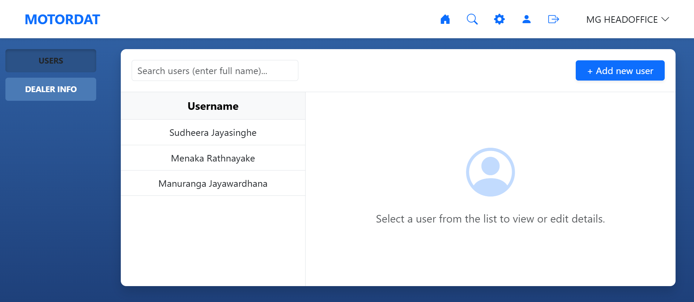
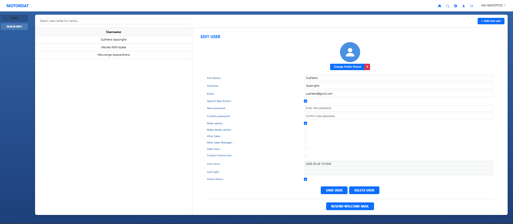
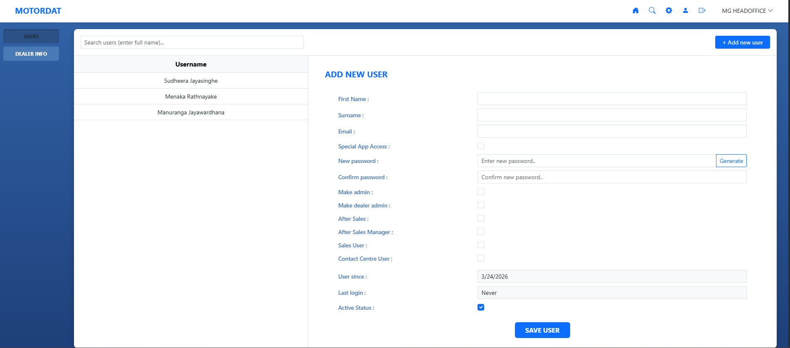

# User Management System

A modern, responsive User Management System built with **PHP (OOP)**, **MySQL**, **Bootstrap**, and **JavaScript/AJAX**. This project demonstrates efficient data handling, secure validation, and a seamless user experience, tailored for technical assignments.

## 🚀 Key Features

- **Responsive User List**: Clean, Bootstrap-powered list that adapts to any screen size.
- **Dynamic Data Retrieval (AJAX)**: View and edit user details instantly without page reloads.
- **Robust Validation**: Comprehensive client-side and server-side validation for data consistency.
- **Secure Architecture**: 
  - Password hashing for security.
  - OOP-based database interactions using Singleton/PDO.
- **User Actions**:
  - Live search/filtering of the user list.
  - Delete confirmation modals to prevent accidental data loss.
  - Integrated password generator for adding new users.

## 🛠️ Technology Stack

- **Backend**: PHP 8.x (Object-Oriented)
- **Database**: MySQL (PDO for secure queries)
- **Frontend**: Bootstrap 5, Vanilla JavaScript (AJAX/Fetch API)
- **Icons**: Bootstrap Icons

## 📸 Project Preview

| User List View | Detailed Profile View | Add New User Flow |
| :---: | :---: | :---: |
|  |  |  |
| *Modern Bootstrap Dashboard* | *AJAX-based profile editing* | *Secure user creation flow* |

## ⚙️ Setup Instructions

### 1. Database Configuration
1. Create a MySQL database named `user_management`.
2. Configure your connection in `.env` (copy from `.env.example` if needed).
3. Ensure your local server (e.g., Apache/MySQL via XAMPP) is running.

### 2. Installation
1. Clone or copy this project to your local server root (e.g., `C:/xampp/htdocs/User_Management`).
2. Rename `.env.example` to `.env` and update your database credentials.
3. Open your browser and navigate to `http://localhost/User_Management`.

---

## 💡 Technical Highlights
- **Modularity**: Business logic is encapsulated in the `User` class for better scalability.
- **Performance**: AJAX fetching ensures the UI remains fast and responsive.
- **Security**: Server-side validation acts as a second line of defense behind client-side checks.

*Note: Email notification features are currently mocked for this demonstration version.*
